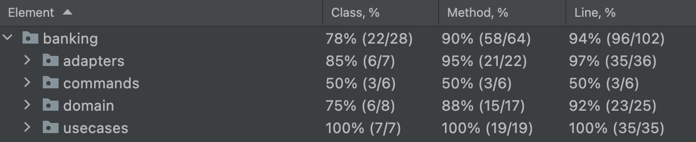

# Bank account - Outside-In kata

## Objectives
Think of your personal bank account experience
When in doubt, go for the simplest solution.

## Problem Description
Create a simple bank system with the following features :
- Deposit into Account
- Withdraw from an account
- Print a bank statement to the console


### Starting points and Constraints
1. Your system should be able to support the operations specified in the below scenario
2. Use `String` for errors, `UUID` for account ids, `Double` for amounts (keep it simple)
3. Use `Use Case` as first class citizens
    - They take a `Command` as input and return a `Result`
    - They contain only 1 public method `invoke`

### Scenario
Here is an acceptance scenario as described by one of our Domain Expert

```gherkin
Scenario: Printing statement after transactions
  Given a client makes a deposit of 1000 on 12-01-2022
  And a deposit of 2000 on 18-01-2022
  And a withdrawal of 500 on 19-01-2022
  When he/she prints her bank statement
  Then he/she would see
  """
  date       |   credit |    debit |  balance
  19-01-2022 |          |   500.00 |  2500.00
  18-01-2022 |  2000.00 |          |  3000.00
  12-01-2022 |  1000.00 |          |  1000.00
  """
```

## Outside-In TDD


## Clean Architecture


## Add an acceptance test
Let's add an acceptance test that will guide us through our implementation.

Step-by-step [here](kata/docs/1.acceptance-tests.md)

## TDD Loops
Go at the Unit Test Level and work on a first `Use Case`.

> What is the responsibility of Use Cases?

Fetch a repository to identify if the `account` exists in the system
- If so, delegate the business logic to the `domain` entity then `store` the new state
- If no, return a failure

### How to test "Use Cases"?
We have several approaches we could use regarding testing Use Cases.
[](https://youtu.be/IZWLnn2fNko)

#### Approach 1 - Testing Use Cases, Gateways & Domain


✅ Advantages
- Testing behavioral decomposition at the lowest level of granularity
- Useful for handling combinatorial explosion within the domain
- Useful for handling mathematically complex domains by testing interim steps

❌ Disadvantages
- We lose oversight of the use case requirements, need additional tests for the use case
- More test code, more expensive to write these tests and more expensive to maintain
- Tests are coupled to system implementation, sensitive to changes in behavioral decomposition and usage of design patterns, thus they are fragile and hinder refactoring

#### Approach 2 - Testing Use Cases & Gateways


✅ Advantages
- Targeting the API of the system (Use Cases & Gateways), not the implementation (Domain)
- Tests are readable as requirement specifications (main flows, exceptional flows)
- High coverage at a low cost - less test code, less expensive to write & maintain tests
- We can refactor system implementation, we can iteratively discover the domain and change behavioral decomposition without breaking the tests - high test robustness

❌ Disadvantages
- For use cases with behavioral combinatorial explosion and/or mathematical complexity, we may need to supplement these tests with more lower-level granular tests (“shifting gears”)

#### Approach 3 - Testing Use Cases


✅ Advantages
- Targeting the API of the system (Use Cases), not the implementation (Domain)
- Tests are readable as requirement specifications (main flows, exceptional flows)
- High coverage at a low cost - less test code, less expensive to write & maintain tests
- Highest test robustness because the tests are coupled only to Use Cases, nothing else

❌ Disadvantages
- Unable to verify side effects on the Gateways in cases where such side-effects are not visible through Use Cases (e.g. the system sets some internal numbers or timestamps on entities updated to the repository, but not exposed through any query Use Cases)

#### Which one to choose?
In general, we recommend `unit testing Use Cases and Gateways` (**Approach 2**) because:
- Use Case tests are coupled to the system API, not the system implementation
- Use Case tests are readable as requirement specs, rather than implementation specs
- High coverage at low test maintenance costs, thus increasing ROI
- High test robustness, we can refactor the system safely without breaking tests

### TDD on Use Cases
- [Deposit](kata/docs/2.deposit.md)
- [Withdraw](kata/docs/3.withdraw.md)
- [Print Statement](kata/docs/4.print-statement.md)

### Let's make our Acceptance Test green
Now that we have made our TDD loops at the `UseCase` level we can focus on making our `acceptance test` green.


> What could be the next steps?

Details [here](kata/docs/5.finish-acceptance-test.md)

### Conclusion
- What do you think of this TDD approach?
- What is the impact of the Clean Architecture? (think about readability, discoverability of your code)
- What is the impact of it on code coverage?




### Resources
- [Original kata](https://github.com/sandromancuso/Bank-kata)
- [Outside In TDD in React](https://youtu.be/20jEMBTGVG4)
- [Growing Object-Oriented Software Guided by Tests - Steve Freeman & Nat Pryce](http://www.growing-object-oriented-software.com/)

[](https://youtu.be/XHnuMjah6ps)
