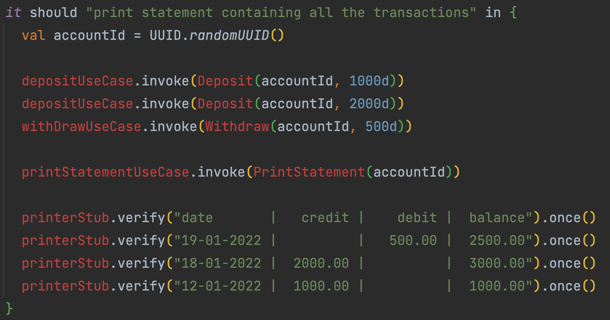
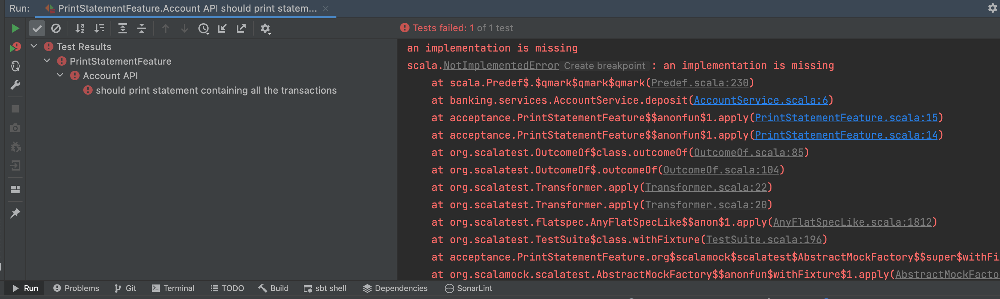

## Add an Acceptance Test
- Add a package `acceptance` under test
- Create a test class `PrintStatementFeature`


:red_circle: let's create our acceptance test based on the business scenario

```scala
class PrintStatementFeature extends AnyFlatSpec with Matchers {
  behavior of "Account API"

  it should "print statement containing all the transactions" in {
    true mustBe false
  }
}
```

Add business scenario details
```scala
import banking.commands.Deposit  it should "print statement containing all the transactions" in {
    // Took the decision that we will represent accountId with a UUID
    val accountId = UUID.randomUUID()

    depositUseCase.invoke(Deposit(accountId, 1000d))
    depositUseCase.invoke(Deposit(accountId, 2000d))
    withDrawUseCase.invoke(Withdraw(accountId, 500d))

    printStatementUseCase.invoke(PrintStatement(accountId))

    printerStub.verify("date       |   credit |    debit |  balance").once()
    printerStub.verify("19-01-2022 |          |   500.00 |  2500.00").once()
    printerStub.verify("18-01-2022 |  2000.00 |          |  3000.00").once()
    printerStub.verify("12-01-2022 |  1000.00 |          |  1000.00").once()
  }
```

- From here, we can generate the necessary objects to compile this code
- We choose to design 1 `Use Case` for each business behavior
  - Instead of having `all-in-one` services



- Generate the related commands inside a `banking.commands` package
```scala
case class Deposit(accountId: UUID, amount: Double) {}
case class PrintStatement(accountId: UUID) {}
case class Withdraw(accountId: UUID, amount: Double) {}
```

- Generate the Use Cases inside a `banking.usecases` package

```scala
import banking.commands.Deposit
class DepositUseCase() {
  def invoke(deposit: Deposit) = ???
}

class PrintStatementUseCase(printer: String => Unit) {
  def invoke(statement: PrintStatement) = ???
}

class WithdrawUseCase() {
  def invoke(withdraw: Withdraw) = ???
}
```

- Instantiate a `stub` function for our test

```scala
import banking.commands.Deposit
class PrintStatementFeature extends AnyFlatSpec with Matchers with MockFactory {
  behavior of "Account API"

  private val printerStub = stubFunction[String, Unit]

  private val depositUseCase = new DepositUseCase()
  private val withDrawUseCase = new WithdrawUseCase()
  private val printStatementUseCase = new PrintStatementUseCase(printerStub)

  it should "print statement containing all the transactions" in {
    val accountId = UUID.randomUUID()

    depositUseCase.invoke(Deposit(accountId, 1000d))
    depositUseCase.invoke(Deposit(accountId, 2000d))
    withDrawUseCase.invoke(Withdraw(accountId, 500d))

    printStatementUseCase.invoke(PrintStatement(accountId))

    printerStub.verify("date       |   credit |    debit |  balance").once()
    printerStub.verify("19-01-2022 |          |   500.00 |  2500.00").once()
    printerStub.verify("18-01-2022 |  2000.00 |          |  3000.00").once()
    printerStub.verify("12-01-2022 |  1000.00 |          |  1000.00").once()
  }
}
```

- Let's improve our test to take into account the order in which the printer should be called
    - We can use the `inSequence` method from `scalamock` for that
```scala
inSequence {
  printerStub.verify("date       |   credit |    debit |  balance").once()
  printerStub.verify("19-01-2022 |          |   500.00 |  2500.00").once()
  printerStub.verify("18-01-2022 |  2000.00 |          |  3000.00").once()
  printerStub.verify("12-01-2022 |  1000.00 |          |  1000.00").once()
}
```

Congrats, you have a failing acceptance test that we will use as an `implementation driver`


